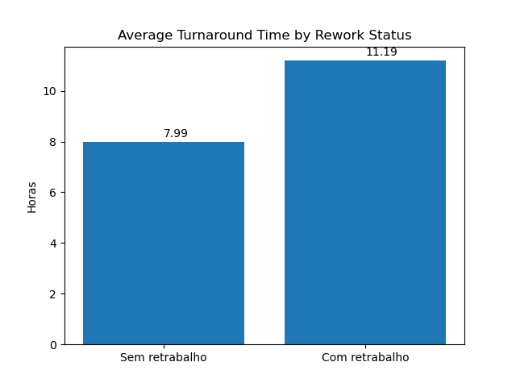
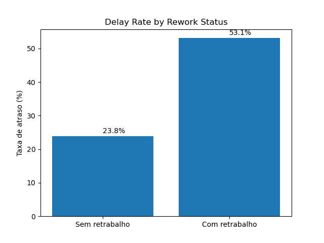

# Laboratory Rework Impact Analysis
Tools: Python, Pandas, Matplotlib, SciPy, Statsmodels

## Overview

Python project to investigate the association between rework and SLA failures in a clinical laboratory using simulated data.

## Business Question

Is rework associated with increased operational delay risk?

## Methods

- Exploratory data analysis  
- TAT comparison  
- Delay rate comparison  
- Relative Risk  
- Chi-square test  
- Logistic Regression  

## Main Findings

- Rework increased average TAT by ~40%

- Delay rate:
  - Without rework: 23.8%
  - With rework: 53.1%

Exams with rework showed 2.23x higher risk of delay.

Exams with rework showed 3.6x higher odds of delay.

- Statistical significance:
p < 0.001

## Key Visual Findings

### Average TAT by Rework Status



### Delay Rate by Rework Status



## Repository Structure

```text
dataset_excel.xlsx
rework_impact_analysis.ipynb

Outputs/
  tat_retrabalho.png
  taxa_atraso.png
```

## Conclusion

Findings suggest rework is associated with increased likelihood of SLA failure and may represent a measurable operational risk factor requiring process investigation.

## Note

Synthetic data created for portfolio purposes.
